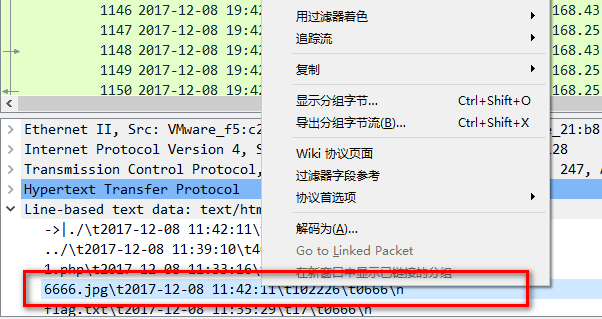
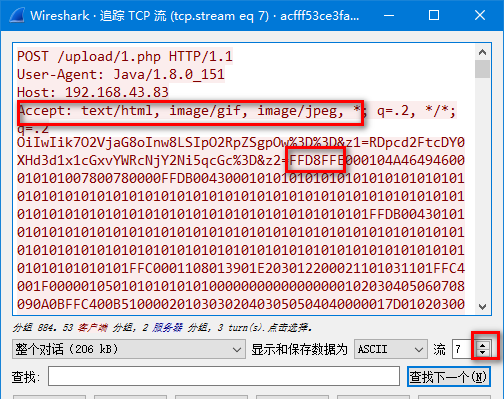
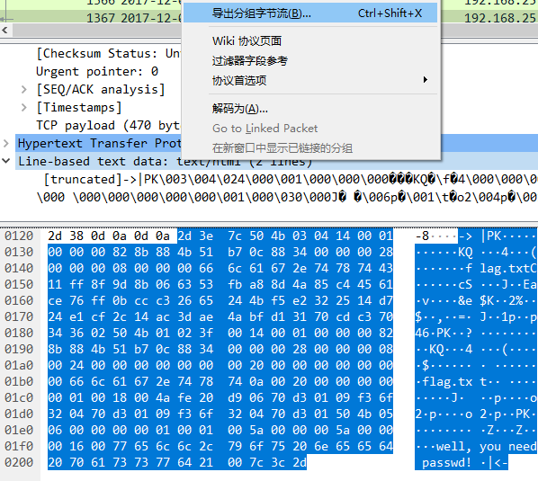
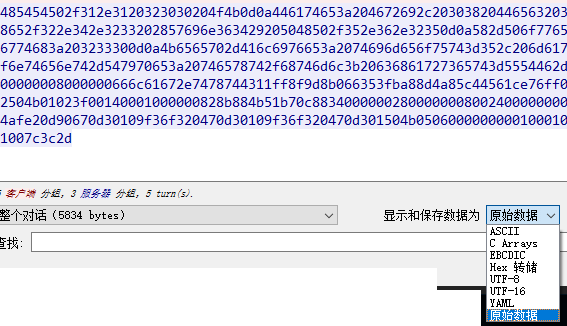

[TOC]

# CTF 相关工具

IDA_pro all 链接：https://pan.baidu.com/s/1zEzqYVRNS69UQc7wfmujXw#y7hz 

Acunetix | Web Application Security Scanner

靶场 awd平台 https://github.com/vidar-team/Cardinal
frpc内网穿透工具


## python

https://www.python.org/ftp/python/3.8.1/python-3.8.1.exe
https://www.python.org/ftp/python/3.5.2/python-3.5.2.exe
https://www.python.org/ftp/python/2.7.16/python-2.7.16.msi

## Burpsuit
快捷键  

Ctrl+Space发送请求 | repater中
### 准备文件
top password之类搜索 
常用字典 https://github.com/rootphantomer/Blasting_dictionary

### 使用方法 
可以默认把intercept关闭, 直接用history, 全选包内容, send to repeater

查看端口: proxy-options

拦截记录: proxy-http history
## Winhex

Q： 怎样粘贴 FFD8 为16进制？
A： Shift+Insert 选ascii-hex。 

### 常用技巧
底部状态栏，会显示偏移位，10进制。
### 快捷键
Ctrl+F时查找时列出更多结果

Ctrl+C 复制
Shift+Ctrl+C 复制16进制

Ctrl+B 粘贴，不进行偏移（菜单编辑-剪贴板数据-写入）

选区域
  Alt+1 右击选块起始
  Alt+2 右击选块结束

dump选区？

点击左侧地址栏，切换10/16进制
### 常用设置 

工具 - 数据解释器， 可以勾选 各种要显示的类型。

在界面上右击数据解释器，可以选 Big Endian。

## 010 Editor

分析 jpg。 打开后按提示install或 菜单: Template - Repository , jpg - install

分析到 char unknownPadding， 使用dd分离。

    dd if=logo.jpg of=2-1.jpg skip=$((0x7011)) bs=1 # 7011是起始地址

或 右击hex窗口中的选中区域，，右击 selection-save selection

insert 切换插入和改写 数据模式

## Wireshark - 浏量数据分析
1.改成zip解压
1.foremost filename
2。文件-导出对象-HTTP-save all
2.telnet协议 右击追踪tcp流
3.右击，显示分组字节流，开始，结束，可以调整去掉字符 。解码为压缩。base64

方法 1. 统计 - 协议分级统计·

方法 2. 文件-导出对象-HTTP

方法 3. 搜索Flag

Kali中 strings easy.pcap | grep flag

方法 4. snmp 网管协议 过滤后 右击follow - udp stream。

搜索字符串 Ctrl+F, 输入字符串， 最左侧选 packet byte. 即可搜索所有字符

过滤协议  Ctrl+/ , 输入协议名回车常见有 tcp udp icmp(ping扫描等) 等

方法 5. 过滤并追踪TCP流和HTTP流。 TCP要每个流都看, HTTP要注意POST请求
### 解码为base64
右击左侧中部，显示分组字节(Ctrl+Shift+O), 解码为 选择base64
### 怎样从流中 追踪指定文件？
在分组列表，右击某文件行。点击追踪流-TCP流。例 6666.jpg



这时流里会有多个文件。jpg文件 为FFD8开头FFD9结尾。 根据header和传输内容来确定。

点击流 右侧的上下箭头来切换流里的文件。直到找到它。


### 怎样从http流导出文件
https://mp.weixin.qq.com/s/mjR9RoxbJBkTfaXB2ao2_A
强网杯2020 Upload

找到http流包, 找到下面的 mime multipart media Encapsulation, jpeg file interchange format,

右击，导出分组字节流。


### 导出ftp文件
1.Filter:ftp-data
2.追踪tcp流
3.保存成raw(原始数据)
### 手动提取zip
已知有zip文件了，Ctrl+F，左侧选16进制值，搜索 504B0304，搜到1个结果。

1.1 在分组列表的 Line-based text data，点击就已经选中PK部分。右击-导出分组字节流 123.zip。



1.2 或者右击分组列表， 追踪TCP流。 来到最下面看到PK了。 点击显示和保存数据为-原始存储。 选中最后蓝色部分，到winhex里粘贴为ascii-hex。从PK头截取存为zip。



##  过滤规则 Filter
path %AppData%\Roaming\Wireshark\
docs https://www.wireshark.org/docs/dfref/

contains 是指文本部分。


```
http contains "GET / foo.cgi?a=bar"
tcp contains "TP"
```

实例1 检查出来有哪些端口是开放的 | `[V&N2020 公开赛]拉胯的三条命令`

方法1: wireshark过滤: `tcp`查看到ACK的。手动排序, 复制成csv再excel过滤。
```
tcp.flags.ack eq 1
tcp.ack_raw gt 0
```

方法2: 使用[tcpdump](https://www.cnblogs.com/lvdongjie/p/10911564.html)过滤, ack包

```
tcpdump -n -r nmapll.pcapng 'tcp[13] = 18' | awk '{print $3}' | sort -u
```


### 过滤 Filter 常用关键字

按 `Ctrl+/` 进入过滤

```
http.request.full_uri  contains skyflag_is_here2333
http.request && !http.request.uri contains "login"
http.file_data contains Hello
urlencoded-form.value contains "testd"     // 表单value包含test
//根据返回结果，text data包含Hello，看对应的request frame 编号
http.host contains weixin
http.response.code==302
//过滤http响应状态码为302的数据包
http.response==1
//过滤所有的http响应包
http.content_type == “text/html”
http.content_length == 279
http.content_length_header == “279″
//根据content_length的数值过滤
```

过滤从192.168.0.9发往192.168.0.99并且是icmp协议

    ip.dst==192.168.0.99 && icmp
    ip.addr==192.168.0.99 && icmp
    ip.addr==192.168.0.9 && ip.addr==192.168.0.99 and icmp
    ip.dst==192.168.0.99 && icmp && !(icmp >= "Destination unreachable")

（1）对源地址为192.168.0.1的包的过滤，即抓取源地址满足要求的包。

         表达式为：ip.src == 192.168.0.1

（2）对目的地址为192.168.0.1的包的过滤，即抓取目的地址满足要求的包。

         表达式为：ip.dst == 192.168.0.1

（4）要排除以上的数据包，我们只需要将其用括号囊括，然后使用 "!" 即可。

         表达式为：!(表达式)

二、针对协议的过滤
（1）仅仅需要捕获某种协议的数据包，表达式很简单仅仅需要把协议的名字输入即可。

                表达式为：http

（2）需要捕获多种协议的数据包，也只需对协议进行逻辑组合即可。

         表达式为：http or telnet （多种协议加上逻辑符号的组合即可）

（3）排除某种协议的数据包

         表达式为：not arp      !tcp

三、针对端口的过滤（视协议而定）

（1）捕获某一端口的数据包

         表达式为：tcp.port == 80

（2）捕获多端口的数据包，可以使用and来连接，下面是捕获高端口的表达式

         表达式为：udp.port >= 2048

四、针对长度和内容的过滤

（1）针对长度的过虑（这里的长度指定的是数据段的长度）

         表达式为：udp.length < 30   http.content_length <=20

（2）针对数据包内容的过滤

    表达式为：http.request.uri matches "vipscu"  （匹配http请求中含有vipscu字段的请求信息）

Show only SMTP (port 25) and ICMP traffic:

    tcp.port eq 25 or icmp
Show only traffic in the LAN (192.168.x.x), between workstations and servers -- no Internet:
    
    ip.src==192.168.0.0/16 and ip.dst==192.168.0.0/16

TCP buffer full -- Source is instructing Destination to stop sending data

    tcp.window_size == 0 && tcp.flags.reset != 1

Filter on Windows -- Filter out noise, while watching Windows Client - DC exchanges

    smb || nbns || dcerpc || nbss || dns


To match IP addresses ending in 255 in a block of subnets (172.16 to 172.31):

    string(ip.dst) matches "^172\.(1[6-9]|2[0-9]|3[0-1])\..{1,3}\.255"


### 过滤端口

```
tcp.port eq 80
tcp.dstport eq 80
tcp.srcport eq 80
tcp.port>=1 and tcp.port <= 80
```
### 过滤请求
```
http and http.request.method==POST         # POST请求
http.request.method in {"HEAD" "GET"}
```

### 过滤MAC地址

eth.dst == aa:00
eth.src eq aa:00

## Wireshark - tshark 使用
https://mymanfile.com/?p=1973

-r readfile

导出http文件
```
path D:\Program Files\Wireshark;%path%
tshark -r ctf.pcapng --export-objects "http,F:/Fshare/"
```
导出request body
```
tshark -r ctf.pcapng -Y "http.request" -T fields -e http.file_data
-Y "http.request" - filters for packets which are http requests
-T fields -e http.file_data - sets the output fields to just the request body
```

tshark -r  -T fields -e http.file_data http.response_number eq 1 and tcp.stream eq 4
提取多个fields, 例 form key,value
```
tshark -r hack.pcap -T fields -e urlencoded-form.key  -e urlencoded-form.value|sed "/^$/d" > usbdata.txt
```
### 过滤
1.过滤端口为5001的tcp包，将时间输出

tshark -r h1.pcap -Y "tcp.port==5001" -T fields -e frame.time

时间格式如   “Jan 1,2016 20:27:30.355595000 CST”

2.调整时间格式

```
tshark -r h1.pcap -Y "tcp.port==5001" -o column.format:"packet,%m,Time,%t,Info,%i"
%t输出格式为 10.710926
%Yt输出格式为 2016-01-01 20:27:30.355595
wireshark - How do I format tshark time to ISO format (yyyy-dd-mm)? - Stack Overflow
tshark\ -\ The\ Wireshark\ Network\ Analyzer\ 2.0.0
```
3.查看所有包数目

tshark -r test.cap | wc -l

c - Getting the number of packets in a pcap capture file? - Stack Overflow

4.输出特定字段

```
tshark -nr input.pcap -Y "display filter" -T fields -e frame.number -e tcp.seq -e tcp.options.timestamp.tsval
https://osqa-ask.wireshark.org/questions/38418/plotting-tcp-sequence-number-against-timestamp-option-value/
```


### 提取 usb 信息

tshark -r flag.pcap -T fields -e usb.capdata > usbdata.txt

## sublime text 
添加公式

https://stackoverflow.com/questions/57232189/sublime-text-3-markdown-preview-chrome-does-not-render-maths-equation

1.markdownpreview settings
```
{
    "enabled_parsers": ["markdown"],
    "enable_mathjax": true,
    "image_path_conversion": "relative",
    "js": [
    "https://cdn.bootcdn.net/ajax/libs/mathjax/2.7.1/MathJax.js",
            "res://MarkdownPreview/js/math_config.js",
    ],
}

```
2.Install Package Resource Viewer

Package Contol: Install Package -> Package Resource Viewer.

Edit math_config.js

`Package Resource Viewer -> Open Resource -> MarkdownPreview -> js -> math_config.js`
Replace the contents with:

```
MathJax.Hub.Config({
  config: ["MMLorHTML.js"],
  extensions: ["tex2jax.js"],
  jax: ["input/TeX", "output/HTML-CSS", "output/NativeMML"],
  tex2jax: {
    inlineMath: [ ['$','$'], ["\\(","\\)"] ],
    displayMath: [ ['$$','$$'], ["\\[","\\]"] ],
    processEscapes: true
  },
  TeX: {
    extensions: ["AMSmath.js", "AMSsymbols.js"],
    TagSide: "right",
    TagIndent: ".8em",
    MultLineWidth: "85%",
    equationNumbers: {
      autoNumber: "AMS",
    },
    unicode: {
      fonts: "STIXGeneral,'Arial Unicode MS'"
    }
  },
  displayAlign: "center",
  showProcessingMessages: false,
  messageStyle: 'none'
});
```


## Cyberchef

- [Decode a Base64-encoded string](https://gchq.github.io/CyberChef/#recipe=From_Base64('A-Za-z0-9%2B/%3D',true)&input=VTI4Z2JHOXVaeUJoYm1RZ2RHaGhibXR6SUdadmNpQmhiR3dnZEdobElHWnBjMmd1)
- [Convert a date and time to a different time zone](https://gchq.github.io/CyberChef/#recipe=Translate_DateTime_Format('Standard date and time','DD/MM/YYYY HH:mm:ss','UTC','dddd Do MMMM YYYY HH:mm:ss Z z','Australia/Queensland')&input=MTUvMDYvMjAxNSAyMDo0NTowMA)
- [Parse a Teredo IPv6 address](https://gchq.github.io/CyberChef/#recipe=Parse_IPv6_address()&input=MjAwMTowMDAwOjQxMzY6ZTM3ODo4MDAwOjYzYmY6M2ZmZjpmZGQy)
- [Convert data from a hexdump, then decompress](https://gchq.github.io/CyberChef/#recipe=From_Hexdump()Gunzip()&input=MDAwMDAwMDAgIDFmIDhiIDA4IDAwIDEyIGJjIGYzIDU3IDAwIGZmIDBkIGM3IGMxIDA5IDAwIDIwICB8Li4uLi6881cu/y7HwS4uIHwKMDAwMDAwMTAgIDA4IDA1IGQwIDU1IGZlIDA0IDJkIGQzIDA0IDFmIGNhIDhjIDQ0IDIxIDViIGZmICB8Li7QVf4uLdMuLsouRCFb/3wKMDAwMDAwMjAgIDYwIGM3IGQ3IDAzIDE2IGJlIDQwIDFmIDc4IDRhIDNmIDA5IDg5IDBiIDlhIDdkICB8YMfXLi6%2BQC54Sj8uLi4ufXwKMDAwMDAwMzAgIDRlIGM4IDRlIDZkIDA1IDFlIDAxIDhiIDRjIDI0IDAwIDAwIDAwICAgICAgICAgICB8TshObS4uLi5MJC4uLnw)
- [Decrypt and disassemble shellcode](https://gchq.github.io/CyberChef/#recipe=RC4({'option':'UTF8','string':'secret'},'Hex','Hex')Disassemble_x86('64','Full x86 architecture',16,0,true,true)&input=MjFkZGQyNTQwMTYwZWU2NWZlMDc3NzEwM2YyYTM5ZmJlNWJjYjZhYTBhYWJkNDE0ZjkwYzZjYWY1MzEyNzU0YWY3NzRiNzZiM2JiY2QxOTNjYjNkZGZkYmM1YTI2NTMzYTY4NmI1OWI4ZmVkNGQzODBkNDc0NDIwMWFlYzIwNDA1MDcxMzhlMmZlMmIzOTUwNDQ2ZGIzMWQyYmM2MjliZTRkM2YyZWIwMDQzYzI5M2Q3YTVkMjk2MmMwMGZlNmRhMzAwNzJkOGM1YTZiNGZlN2Q4NTlhMDQwZWVhZjI5OTczMzYzMDJmNWEwZWMxOQ)
- [Array | Display multiple timestamps as full dates](https://gchq.github.io/CyberChef/#recipe=Fork('\\n','\\n',false)From_UNIX_Timestamp('Seconds (s)')&input=OTc4MzQ2ODAwCjEwMTI2NTEyMDAKMTA0NjY5NjQwMAoxMDgxMDg3MjAwCjExMTUzMDUyMDAKMTE0OTYwOTYwMA)
- [Condition | Carry out different operations on data of different types](https://gchq.github.io/CyberChef/#recipe=Fork('\\n','\\n',false)Conditional_Jump('1',false,'base64',10)To_Hex('Space')Return()Label('base64')To_Base64('A-Za-z0-9%2B/%3D')&input=U29tZSBkYXRhIHdpdGggYSAxIGluIGl0ClNvbWUgZGF0YSB3aXRoIGEgMiBpbiBpdA)
- [Register | Use parts of the input as arguments to operations](https://gchq.github.io/CyberChef/#recipe=Register('key%3D([\\da-f]*)',true,false)Find_/_Replace({'option':'Regex','string':'.*data%3D(.*)'},'$1',true,false,true)RC4({'option':'Hex','string':'$R0'},'Hex','Latin1')&input=aHR0cDovL21hbHdhcmV6LmJpei9iZWFjb24ucGhwP2tleT0wZTkzMmE1YyZkYXRhPThkYjdkNWViZTM4NjYzYTU0ZWNiYjMzNGUzZGIxMQ)
- [Perform AES decryption, extracting the IV from the beginning of the cipher stream](https://gchq.github.io/CyberChef/#recipe=Register('(.{32})',true,false)Drop_bytes(0,32,false)AES_Decrypt({'option':'Hex','string':'1748e7179bd56570d51fa4ba287cc3e5'},{'option':'Hex','string':'$R0'},'CTR','Hex','Raw',{'option':'Hex','string':''})&input=NTFlMjAxZDQ2MzY5OGVmNWY3MTdmNzFmNWI0NzEyYWYyMGJlNjc0YjNiZmY1M2QzODU0NjM5NmVlNjFkYWFjNDkwOGUzMTljYTNmY2Y3MDg5YmZiNmIzOGVhOTllNzgxZDI2ZTU3N2JhOWRkNmYzMTFhMzk0MjBiODk3OGU5MzAxNGIwNDJkNDQ3MjZjYWVkZjU0MzZlYWY2NTI0MjljMGRmOTRiNTIxNjc2YzdjMmNlODEyMDk3YzI3NzI3M2M3YzcyY2Q4OWFlYzhkOWZiNGEyNzU4NmNjZjZhYTBhZWUyMjRjMzRiYTNiZmRmN2FlYjFkZGQ0Nzc2MjJiOTFlNzJjOWU3MDlhYjYwZjhkYWY3MzFlYzBjYzg1Y2UwZjc0NmZmMTU1NGE1YTNlYzI5MWNhNDBmOWU2MjlhODcyNTkyZDk4OGZkZDgzNDUzNGFiYTc5YzFhZDE2NzY3NjlhN2MwMTBiZjA0NzM5ZWNkYjY1ZDk1MzAyMzcxZDYyOWQ5ZTM3ZTdiNGEzNjFkYTQ2OGYxZWQ1MzU4OTIyZDJlYTc1MmRkMTFjMzY2ZjMwMTdiMTRhYTAxMWQyYWYwM2M0NGY5NTU3OTA5OGExNWUzY2Y5YjQ0ODZmOGZmZTljMjM5ZjM0ZGU3MTUxZjZjYTY1MDBmZTRiODUwYzNmMWMwMmU4MDFjYWYzYTI0NDY0NjE0ZTQyODAxNjE1YjhmZmFhMDdhYzgyNTE0OTNmZmRhN2RlNWRkZjMzNjg4ODBjMmI5NWIwMzBmNDFmOGYxNTA2NmFkZDA3MWE2NmNmNjBlNWY0NmYzYTIzMGQzOTdiNjUyOTYzYTIxYTUzZg)
- [Automagically detect several layers of nested encoding](https://gchq.github.io/CyberChef/#recipe=Magic(3,false,false)&input=V1VhZ3dzaWFlNm1QOGdOdENDTFVGcENwQ0IyNlJtQkRvREQ4UGFjZEFtekF6QlZqa0syUXN0RlhhS2hwQzZpVVM3UkhxWHJKdEZpc29SU2dvSjR3aGptMWFybTg2NHFhTnE0UmNmVW1MSHJjc0FhWmM1VFhDWWlmTmRnUzgzZ0RlZWpHWDQ2Z2FpTXl1QlY2RXNrSHQxc2NnSjg4eDJ0TlNvdFFEd2JHWTFtbUNvYjJBUkdGdkNLWU5xaU45aXBNcTFaVTFtZ2tkYk51R2NiNzZhUnRZV2hDR1VjOGc5M1VKdWRoYjhodHNoZVpud1RwZ3FoeDgzU1ZKU1pYTVhVakpUMnptcEM3dVhXdHVtcW9rYmRTaTg4WXRrV0RBYzFUb291aDJvSDRENGRkbU5LSldVRHBNd21uZ1VtSzE0eHdtb21jY1BRRTloTTE3MkFQblNxd3hkS1ExNzJSa2NBc3lzbm1qNWdHdFJtVk5OaDJzMzU5d3I2bVMyUVJQ)

Util:
   Drop 删除字符
   Take 保留字符
## Claunch
cmd
文件名 %comspec%
参数  /k doskey ds=python dirsearch.py -w "D:\wgf\My Documents\GitHub\blog\vuepress-starter\docs\ctf\assets\db\dicc.txt" -ephp -u $*
